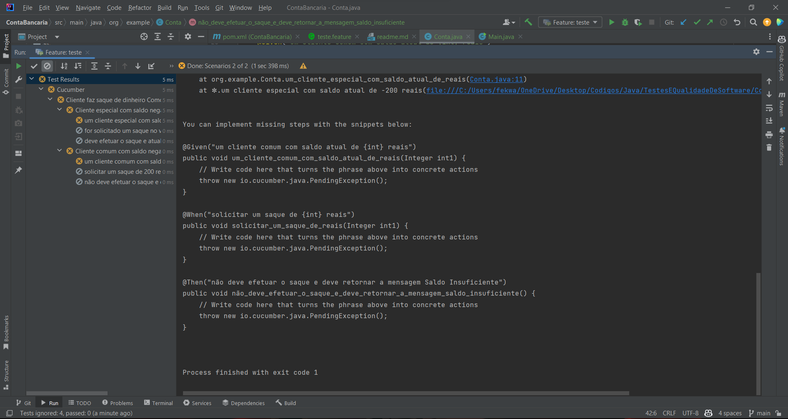

# Projeto BDD - Conta bancaria

# Parte 1
 Implementar o cenario de teste com o seguinte texto

```cucumber
Feature: Cliente faz saque de dinheiro Como um cliente,
  eu gostaria de sacar dinheiro em caixa eletrônico,
  para que eu nao tenha que esperar em uma fila do banco.

  Scenario: Cliente especial com saldo negativo
    Given um cliente especial com saldo atual de -200 reais
    When for solicitado um saque no valor de 100 reais
    Then deve efetuar o saque e atualizar o saldo da conta para -300 reais

  Scenario: Cliente comum com saldo negativo
    Given um cliente comum com saldo atual de -300 reais
    When solicitar um saque de 200 reais
    Then não deve efetuar o saque e deve retornar a mensagem Saldo Insuficiente
```

Após executar o cenario ele irá sugerir os metodos que devem ser implementados, nesse caso irei implementar na classe
Conta.java


## parte 2 Cliente especial
 Implementar os metodos sugeridos na conta Conta.java para o cliente especial
 


## parte 3 Cliente especial
 Rodar o teste agora com o codigo implementado no Conta.java
 

## parte 4 Cliente comum
 Implementar os metodos sugeridos na conta Conta.java para o cliente comum


## parte 5 Cliente comum
    Rodar o teste agora com o codigo implementado no Conta.java


## parte 6 Colocando prints nos metodos
assim fica mais facil saber se tudo esta funcionando
